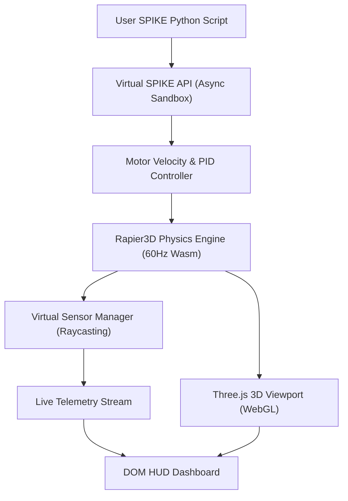

# Architecture & Engineering Design

This document details the software architecture, physical simulation pipeline, kinematic solver, and mathematical models behind `fll-sim`.

---

## 1. System Architecture

The simulator is structured into six strictly decoupled layers with unidirectional data flow:

### Module Responsibilities

| Layer | Path | Core Functionality | Headless Capable? |
|---|---|---|---|
| **CAD Ingestion** | `src/cad/` | LDraw parser, Studio `.io` extractor, Technic catalog, clustering pre-solver | Yes |
| **Physics** | `src/physics/` | Rapier3D Wasm world, compound bodies, motor joints, 4x8 ft arena walls | Yes |
| **Sensors** | `src/sensors/` | Raycast ground UV sampling, Gyro IMU quaternion heading extraction | Yes |
| **Runtime** | `src/runtime/` | Virtual SPIKE Prime API, Python AST transpiler, cooperative abort | Yes |
| **Viewport** | `src/view/` | Three.js scene, lighting, procedural vinyl mat canvas, mesh synchronization | Browser / WebGL |
| **UI** | `src/ui/` | DOM HUD, Python code editor, mission presets, live telemetry | Browser / DOM |

---

## 2. Topological Pin & Fastener Clustering

### The Challenge of LEGO Physics
A typical FLL competition robot consists of 300 to 600 pieces:
* 100+ Technic friction pins (2780, 6558, 32054)
* Dozens of liftarms, beams, and frames
* Hub, battery, and motors
* Wheels and attachments

If each pin and beam is simulated as an independent rigid body connected by physics joints, the constraint solver faces thousands of simultaneous equations. The simulation quickly lags, collapses, or explodes.

### The Clustering Pre-Solver Solution
`fll-sim` analyzes the connectivity graph before handing geometry to Rapier3D:
1. **Catalog Classification**: Every part is tagged by role: `FASTENER_PIN`, `STRUCTURAL_BEAM`, `CHASSIS_CORE`, `MOTOR_STATOR`, `MOTOR_ROTOR`, or `WHEEL_RIM`.
2. **Graph Connected Components**: All parts connected by rigid friction pins are merged into an equivalence class.
3. **Compound Body Generation**: Each connected component becomes **one** Rapier rigid body equipped with an array of primitive colliders (boxes, cylinders, spheres).
4. **Joint Identification**: Only active degrees of freedom (axles seated in motor stators, free-spinning wheel hubs) are converted into Rapier 1-DOF Revolute Joints.

As a result, a 400+ part robot collapses into **$\le 4$ rigid bodies**:
* **Body 0**: Main Chassis (Hub, battery, frame, sensors, fixed motor stators)
* **Body 1**: Left Drive Wheel
* **Body 2**: Right Drive Wheel
* **Body 3**: Rear Caster Skid

---

## 3. Mathematical & Kinematic Formulations

### 3.1 Wheel Kinematics & Degrees
For an FLL robot with wheel diameter $D = 56\text{ mm}$:
$$C = \pi \cdot D \approx 17.593\text{ cm}$$

To drive a linear distance $d$ in centimeters:
$$\Delta \theta = \left(\frac{d}{\pi \cdot D}\right) \times 360^\circ$$

For differential drive steering:
$$\text{Speed}_{\text{left}} = V \cdot \left(1 - \frac{2 \cdot \max(0, -S)}{100}\right)$$
$$\text{Speed}_{\text{right}} = V \cdot \left(1 - \frac{2 \cdot \max(0, S)}{100}\right)$$
where $S \in [-100, 100]$ is the steering value.

### 3.2 Gyro Yaw Angle Extraction
The robot's heading yaw $\theta$ is extracted directly from the chassis rigid body quaternion $q = (x, y, z, w)$:
$$\theta = \text{atan2}\left(2(wy - zx),\, 1 - 2(y^2 + x^2)\right) \times \frac{180}{\pi}$$

### 3.3 Sensor UV Projection & Reflected Light
Color sensors cast a downward ray from $(X_0, Y_0, Z_0)$ rotated by the chassis yaw to find the mat intersection point $(X_{\text{mat}}, Z_{\text{mat}})$.
The coordinates are mapped to normalized texture coordinates:
$$u = \frac{X_{\text{mat}} + L/2}{L}, \quad v = \frac{Z_{\text{mat}} + W/2}{W}$$
Reflected light is computed via human perceived luminance:
$$\text{Reflected Light \%} = \text{round}\left(\frac{0.299R + 0.587G + 0.114B}{255} \times 100\right)$$
